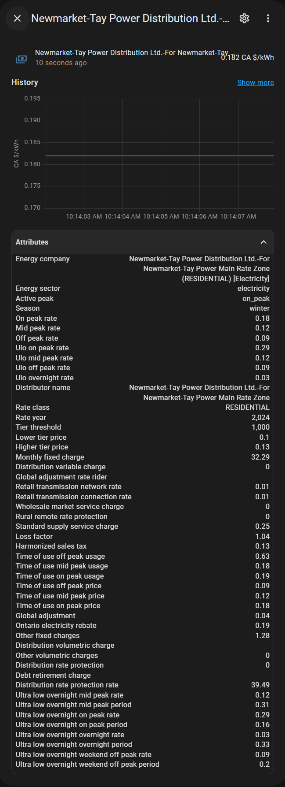

# Ontario Energy Board integration

This [Home Assistant](https://home-assistant.io/) component installs a sensor with the current energy rate and active peak for Ontario, Canada based companies, using the Ontario Energy Board's official open data inventory. Find out more at https://www.oeb.ca/open-data

# Installation

## HACS
1. Open integrations.
1. Click "Explore + Download repositories"
1. Search for "Ontario Energy Board" and install the found integration.

## Manual
Clone or download the repo, and copy the "ontario_energy_board" folder in "custom_components" to the "custom_components" folder in home assistant.

## Using the component

Once installed, use the UI to add the new component to your setup, or click on the button below:

### Attributes

The sensor will include extra attributes for most of the available data from your energy supplier, enabling you to replicate your hydro and or natural gas bill if needed. @Digital-Ark [shared](https://github.com/jrfernandes/ontario_energy_board/issues/10#issuecomment-1242147422) this great [Google Sheets](https://docs.google.com/spreadsheets/d/14pV23ip7UQH6B72HYhsWEpsCbo_X1aII/) document containing the billing formula using the attributes extracted by this integration:

| Attribute                                | Sector                    | OEB Key        | Unit         | Description                                                                |
|:-----------------------------------------|:--------------------------|:---------------|:-------------|:---------------------------------------------------------------------------|
| `energy_company`                         | Electricity / Natural Gas |                |              | Energy company name                                                        |
| `energy_sector`                          | Electricity / Natural Gas |                |              | Energy sector (`electricity` / `natural_gas`)                              |
| `active_peak`                            | Electricity / Natural Gas |                |              | Active Peak (No Peak - Natural Gas)                                        |
| `season`                                 | Electricity / Natural Gas |                |              | Current Season (`winter` or `summer`)                                      |
| `ulo_enabled`                            | Electricity               |                |              | ULO Rates status                                                           |
| `ulo_overnight_rate`                     | Electricity               |                | CA$/kWh      | ULO Overnight Rate                                                         |
| `ulo_off_peak_rate`                      | Electricity               |                | CA$/kWh      | ULO Weekend Off-peak Rate                                                  |
| `ulo_mid_peak_rate`                      | Electricity               |                | CA$/kWh      | ULO Mid-peak Rate                                                          |
| `ulo_on_peak_rate`                       | Electricity               |                | CA$/kWh      | ULO On-peak Rate                                                           |
| `off_peak_rate`                          | Electricity               |                | CA$/kWh      | Off-peak Rate                                                              |
| `mid_peak_rate`                          | Electricity               |                | CA$/kWh      | Mid-peak Rate                                                              |
| `on_peak_rate`                           | Electricity               |                | CA$/kWh      | On-peak Rate                                                               |
| `distributor_name`                       | Electricity               | `Dist`         |              | Distributor name                                                           |
| `rate_class`                             | Electricity               | `Class`        |              | Rate class                                                                 |
| `rate_year`                              | Electricity               | `YEAR`         |              | Rate year                                                                  |
| `tier_threshold`                         | Electricity               | `ET1`          | kWh          | Tier Threshold                                                             |
| `lower_tier_price`                       | Electricity               | `RPP1`         | CA$/kWh      | Tier lower price                                                           |
| `higher_tier_price`                      | Electricity               | `RPP2`         | CA$/kWh      | Tier higher price                                                          |
| `monthly_fixed_charge`                   | Electricity               | `SC`           | CA$/kWh      | Service Charge (monthly fixed charge)                                      |
| `distribution_variable_charge`           | Electricity               | `DC`           | CA$/kWh      | Distribution variable charge                                               |
| `global_adjustment_rate_rider`           | Electricity               | `GA_RR_NONRPP` | CA$/kWh      | Global adjustment rate rider                                               |
| `retail_transmission_network_rate`       | Electricity               | `Net`          | CA$/kWh      | Retail transmission network rate                                           |
| `retail_transmission_connection_rate`    | Electricity               | `Conn`         | CA$/kWh      | Retail transmission connection rate                                        |
| `wholesale_market_service_charge`        | Electricity               | `WMSR`         | CA$/kWh      | Wholesale market service charge                                            |
| `rural_remote_rate_protection`           | Electricity               | `RRRp`         | CA$/kWh      | Rural and Remote rate protection                                           |
| `standard_supply_service_charge`         | Electricity               | `SSS`          | CA$          | Standard supply service charge                                             |
| `loss_factor`                            | Electricity               | `LF`           | CA$/kWh      | Loss factor                                                                |
| `harmonized_sales_tax`                   | Electricity / Natural Gas | `GST`          | %            | Harmonized sales tax (HST)                                                 |
| `time_of_use_off_peak_usage`             | Electricity               | `EOffP`        | %            | Time-of-use off-peak usage (average across residential consumers)          |
| `time_of_use_mid_peak_usage`             | Electricity               | `EMidP`        | %            | Time-of-use mid-peak usage (average across residential consumers)          |
| `time_of_use_on_peak_usage`              | Electricity               | `EOnP`         | %            | Time-of-use on-peak usage (average across residential consumers)           |
| `time_of_use_off_peak_price`             | Electricity               | `RPPOffP`      | CA$/kWh      | Time-of-use off-peak price                                                 |
| `time_of_use_mid_peak_price`             | Electricity               | `RPPMidP`      | CA$/kWh      | Time-of-use mid-peak price                                                 |
| `time_of_use_on_peak_price`              | Electricity               | `RPPOnP`       | CA$/kWh      | Time-of-use on-peak price                                                  |
| `global_adjustment`                      | Electricity               | `PBGA`         | CA$/kWh      | Global adjustment                                                          |
| `ontario_electricity_rebate`             | Electricity               | `Rebate`       | %            | Ontario electricity rebate (% of subtotal)                                 |
| `other_fixed_charges`                    | Electricity               | `OFC`          | CA$/customer | Other fixed charges                                                        |
| `distribution_volumetric_charge`         | Electricity               | `VC`           | CA$/kWh      | Distribution volumetric charge                                             |
| `other_volumetric_charge`                | Electricity               | `OC`           | CA$/kWh      | Other volumetric charge                                                    |
| `distribution_rate_protection`           | Electricity               | `DRP`          | Boolean      | Distribution rate protection (0 - no / 1 - yes)                            |
| `debt_retirement_charge`                 | Electricity               | `DRC`          | CA$/kWh      | Debt retirement charge                                                     |
| `distribution_rate_protection_rate`      | Electricity               | `DRP_Rate`     | CA$/customer | Distribution rate protection rate                                          |
| `service_area`                           | Natural Gas               | `SA`           |              | Service area                                                               |
| `rate_class`                             | Natural Gas               | `RC`           |              | Rate class                                                                 |
| `effective_date`                         | Natural Gas               | `ED`           |              | Effective Date                                                             |
| `monthly_charge`                         | Natural Gas               | `MC`           | CA$/month    | Monthly charge                                                             |
| `delivery_tier_1_start`                  | Natural Gas               | `DT1Low`       | m³           | Delivery tier 1 start                                                      |
| `delivery_tier_1_end`                    | Natural Gas               | `DT1High`      | m³           | Delivery tier 1 end                                                        |
| `delivery_tier_2_start`                  | Natural Gas               | `DT2Low`       | m³           | Delivery tier 2 start                                                      |
| `delivery_tier_2_end`                    | Natural Gas               | `DT2High`      | m³           | Delivery tier 2 end                                                        |
| `delivery_tier_3_start`                  | Natural Gas               | `DT3Low`       | m³           | Delivery tier 3 start                                                      |
| `delivery_tier_3_end`                    | Natural Gas               | `DT3High`      | m³           | Delivery tier 3 end                                                        |
| `delivery_tier_4_start`                  | Natural Gas               | `DT4Low`       | m³           | Delivery tier 4 start                                                      |
| `delivery_tier_4_end`                    | Natural Gas               | `DT4High`      | m³           | Delivery tier 4 end                                                        |
| `delivery_tier_5_start`                  | Natural Gas               | `DT5Low`       | m³           | Delivery tier 5 start                                                      |
| `delivery_tier_5_end`                    | Natural Gas               | `DT5High`      | m³           | Delivery tier 5 end                                                        |
| `delivery_charge_tier_1`                 | Natural Gas               | `DCT1`         | CA$/m³       | Delivery charge tier 1                                                     |
| `delivery_charge_tier_2`                 | Natural Gas               | `DCT2`         | CA$/m³       | Delivery charge tier 2                                                     |
| `delivery_charge_tier_3`                 | Natural Gas               | `DCT3`         | CA$/m³       | Delivery charge tier 3                                                     |
| `delivery_charge_tier_4`                 | Natural Gas               | `DCT4`         | CA$/m³       | Delivery charge tier 4                                                     |
| `delivery_charge_tier_5`                 | Natural Gas               | `DCT5`         | CA$/m³       | Delivery charge tier 5                                                     |
| `delivery_charge_price_adjustment`       | Natural Gas               | `DCPA`         | CA$/m³       | Delivery charge price adjustment                                           |
| `storage_charge`                         | Natural Gas               | `SC`           | CA$/m³       | Storage charge                                                             |
| `storage_charge_price_adjustment`        | Natural Gas               | `SCPA`         | CA$/m³       | Storage charge price adjustment                                            |
| `gas_supply_charge`                      | Natural Gas               | `CM`           | CA$/m³       | Gas supply charge                                                          |
| `gas_supply_charge_price_adjustment`     | Natural Gas               | `CMPA`         | CA$/m³       | Gas supply charge price adjustment                                         |
| `transportation_charge`                  | Natural Gas               | `TC`           | CA$/m³       | Transportation charge                                                      |
| `transportation_charge_price_adjustment` | Natural Gas               | `TCPA`         | CA$/m³       | Transportation charge price sdjustment                                     |
| `federal_carbon_charge`                  | Natural Gas               | `FedCC`        | CA$/m³       | Federal carbon charge                                                      |
| `facility_carbon_charge`                 | Natural Gas               | `FacCC`        | CA$/m³       | Facility carbon charge                                                     |
| `january`                                | Natural Gas               | `Jan`          | ~ m³         | January (average monthly usage)                                            |
| `february`                               | Natural Gas               | `Feb`          | ~ m³         | February (average monthly usage)                                           |
| `march`                                  | Natural Gas               | `Mar`          | ~ m³         | March (average monthly usage)                                              |
| `april`                                  | Natural Gas               | `Apr`          | ~ m³         | April (average monthly usage)                                              |
| `may`                                    | Natural Gas               | `May`          | ~ m³         | May (average monthly usage)                                                |
| `june`                                   | Natural Gas               | `Jun`          | ~ m³         | June (average monthly usage)                                               |
| `july`                                   | Natural Gas               | `Jul`          | ~ m³         | July (average monthly usage)                                               |
| `august`                                 | Natural Gas               | `Aug`          | ~ m³         | August (average monthly usage)                                             |
| `september`                              | Natural Gas               | `Sep`          | ~ m³         | September (average monthly usage)                                          |
| `october`                                | Natural Gas               | `Oct`          | ~ m³         | October (average monthly usage)                                            |
| `november`                               | Natural Gas               | `Nov`          | ~ m³         | November (average monthly usage)                                           |
| `december`                               | Natural Gas               | `Dec`          | ~ m³         | December (average monthly usage)                                           |
