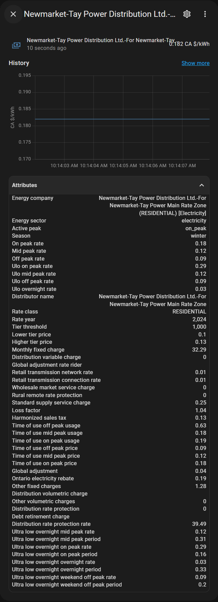
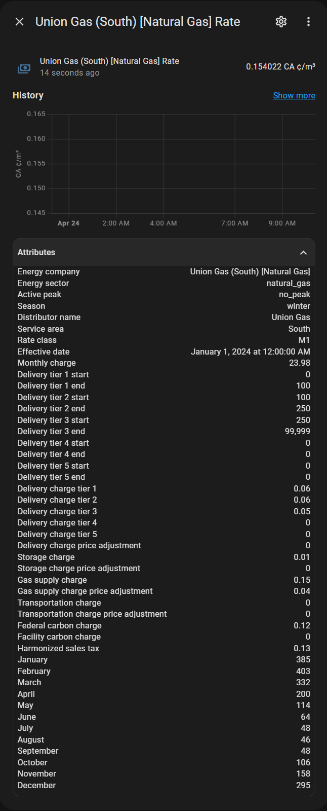

# Ontario Energy Board integration
[](https://github.com/hacs/integration)
[](https://github.com/jrfernandes/ontario_energy_board/actions/workflows/pytest.yml)
[](https://github.com/jrfernandes/ontario_energy_board/actions/workflows/hacs.yml)
[](https://github.com/jrfernandes/ontario_energy_board/actions/workflows/hassfest.yml)
[](https://github.com/jrfernandes/ontario_energy_board/actions/workflows/oeb_coverage.yml)


This [Home Assistant](https://home-assistant.io/) component adds a device for your Ontario, Canada energy company (Electricity or Natural Gas), with sensors for the current rate, the active peak period, and the individual charges that make up your bill. Rates come from the Ontario Energy Board's official open data inventory. Find out more at https://www.oeb.ca/open-data

The current rate sensor can drive cost tracking in Home Assistant's Energy dashboard, following the Time-of-Use or Ultra-Low Overnight schedule through the day.

## Electricity


## Natural Gas



# Installation

## HACS
1. Open integrations.
1. Click "Explore + Download repositories"
1. Search for "Ontario Energy Board" and install the found integration.

## Manual
Clone or download the repo, and copy the "ontario_energy_board" folder in "custom_components" to the "custom_components" folder in home assistant.


## Using the component

Once installed, use the UI to add the new component to your setup, or click on the button below:

[](https://my.home-assistant.io/redirect/config_flow_start?domain=ontario_energy_board)


# Entities

Each configured company becomes a **device** carrying its own entities. The
default set is deliberately small; everything else is created as a disabled
diagnostic, so you can enable exactly what you need from the device page
without carrying entities you will never look at.

**Current rate** is the one to put on a dashboard. It follows the Time-of-Use
or Ultra-Low Overnight schedule automatically, including Ontario holidays.

## Cost tracking in the Energy dashboard

`Current rate` is shaped so Home Assistant can use it as a price source. In
**Settings → Dashboards → Energy**, edit your electricity or gas consumption
source, choose *Use an entity with current price*, and select it. Costs then
follow the peak schedule through the day rather than assuming a flat rate.

## Upgrading from 0.x

Version 1.0.0 replaces the single sensor and its attributes with a device and
individual entities.

- **The state attributes are gone.** Anything using
  `state_attr('sensor.…', 'off_peak_rate')` needs to move to the matching
  entity. Some ship disabled; enable them from the device page.
- **Your existing rate sensor survives.** It keeps its entity ID and its
  history, and becomes `Current rate`. Its friendly name changes.
- **`device_class: monetary` was removed** from it. That device class means
  *an amount of money* and expects a total state class, which a price per kWh
  is not. Rates now carry `state_class: measurement`, so they finally produce
  long-term statistics.
- **The natural gas unit changed** from `CA ¢/m³` to `CAD/m³`. The numbers were
  always dollars, so the old label was wrong by a factor of 100. Home Assistant
  may ask about the unit change on existing statistics.
- **Entities now belong to a device**, so they are grouped under it rather than
  appearing loose.

## Available entities

#### Electricity — Time-of-Use

| Entity | On by default | Unit | OEB key |
|:--|:--|:--|:--|
| Current rate | **yes** | `CAD/kWh` | `RPPOnP / RPPMidP / RPPOffP / ULO_* / CM` |
| Active peak | **yes** | `—` | `—` |
| Season | **yes** | `—` | `—` |
| Off-peak rate | **yes** | `CAD/kWh` | `RPPOffP` |
| Mid-peak rate | **yes** | `CAD/kWh` | `RPPMidP` |
| On-peak rate | **yes** | `CAD/kWh` | `RPPOnP` |
| ULO overnight rate | no | `CAD/kWh` | `ULO_overnight` |
| ULO weekend off-peak rate | no | `CAD/kWh` | `ULO_weekendoffp` |
| ULO mid-peak rate | no | `CAD/kWh` | `ULO_midp` |
| ULO on-peak rate | no | `CAD/kWh` | `ULO_onp` |
| Distribution variable charge | no | `CAD/kWh` | `DC` |
| Distribution volumetric charge | no | `CAD/kWh` | `VC` |
| Other volumetric charges | no | `CAD/kWh` | `OC` |
| Global adjustment | no | `CAD/kWh` | `PBGA` |
| Global adjustment rate rider | no | `CAD/kWh` | `GA_RR_NONRPP` |
| Transmission network rate | no | `CAD/kWh` | `Net` |
| Transmission connection rate | no | `CAD/kWh` | `Conn` |
| Wholesale market service charge | no | `CAD/kWh` | `WMSR` |
| Rural and remote rate protection | no | `CAD/kWh` | `RRRP` |
| Debt retirement charge | no | `CAD/kWh` | `DRC` |
| Lower tier price | no | `CAD/kWh` | `RPP1` |
| Higher tier price | no | `CAD/kWh` | `RPP2` |
| Monthly service charge | no | `CAD` | `SC` |
| Standard supply service charge | no | `CAD` | `SSS` |
| Other fixed charges | no | `CAD` | `OFC` |
| Distribution rate protection rate | no | `CAD` | `DRP_Rate` |
| Harmonized sales tax | no | `%` | `GST` |
| Ontario electricity rebate | no | `%` | `Rebate` |
| Tier threshold | no | `kWh` | `ET1` |
| Loss factor | no | `—` | `LF` |
| Rate year | no | `—` | `YEAR` |
| Distribution rate protection | no | `—` | `DRP` |

#### Electricity — Ultra-Low Overnight

| Entity | On by default | Unit | OEB key |
|:--|:--|:--|:--|
| Current rate | **yes** | `CAD/kWh` | `RPPOnP / RPPMidP / RPPOffP / ULO_* / CM` |
| Active peak | **yes** | `—` | `—` |
| ULO overnight rate | **yes** | `CAD/kWh` | `ULO_overnight` |
| ULO weekend off-peak rate | **yes** | `CAD/kWh` | `ULO_weekendoffp` |
| ULO mid-peak rate | **yes** | `CAD/kWh` | `ULO_midp` |
| ULO on-peak rate | **yes** | `CAD/kWh` | `ULO_onp` |
| Off-peak rate | no | `CAD/kWh` | `RPPOffP` |
| Mid-peak rate | no | `CAD/kWh` | `RPPMidP` |
| On-peak rate | no | `CAD/kWh` | `RPPOnP` |
| Distribution variable charge | no | `CAD/kWh` | `DC` |
| Distribution volumetric charge | no | `CAD/kWh` | `VC` |
| Other volumetric charges | no | `CAD/kWh` | `OC` |
| Global adjustment | no | `CAD/kWh` | `PBGA` |
| Global adjustment rate rider | no | `CAD/kWh` | `GA_RR_NONRPP` |
| Transmission network rate | no | `CAD/kWh` | `Net` |
| Transmission connection rate | no | `CAD/kWh` | `Conn` |
| Wholesale market service charge | no | `CAD/kWh` | `WMSR` |
| Rural and remote rate protection | no | `CAD/kWh` | `RRRP` |
| Debt retirement charge | no | `CAD/kWh` | `DRC` |
| Lower tier price | no | `CAD/kWh` | `RPP1` |
| Higher tier price | no | `CAD/kWh` | `RPP2` |
| Monthly service charge | no | `CAD` | `SC` |
| Standard supply service charge | no | `CAD` | `SSS` |
| Other fixed charges | no | `CAD` | `OFC` |
| Distribution rate protection rate | no | `CAD` | `DRP_Rate` |
| Harmonized sales tax | no | `%` | `GST` |
| Ontario electricity rebate | no | `%` | `Rebate` |
| Tier threshold | no | `kWh` | `ET1` |
| Loss factor | no | `—` | `LF` |
| Rate year | no | `—` | `YEAR` |
| Distribution rate protection | no | `—` | `DRP` |

#### Natural gas

| Entity | On by default | Unit | OEB key |
|:--|:--|:--|:--|
| Current rate | **yes** | `CAD/m³` | `RPPOnP / RPPMidP / RPPOffP / ULO_* / CM` |
| Monthly charge | **yes** | `CAD` | `MC` |
| Transportation charge | **yes** | `CAD/m³` | `TC` |
| Federal carbon charge | **yes** | `CAD/m³` | `FedCC` |
| Facility carbon charge | **yes** | `CAD/m³` | `FacCC` |
| Storage charge | **yes** | `CAD/m³` | `SC` |
| Effective date | **yes** | `—` | `ED` |
| Delivery charge tier 1 | no | `CAD/m³` | `DCT1` |
| Delivery tier 1 start | no | `m³` | `DT1Low` |
| Delivery tier 1 end | no | `m³` | `DT1High` |
| Delivery charge tier 2 | no | `CAD/m³` | `DCT2` |
| Delivery tier 2 start | no | `m³` | `DT2Low` |
| Delivery tier 2 end | no | `m³` | `DT2High` |
| Delivery charge tier 3 | no | `CAD/m³` | `DCT3` |
| Delivery tier 3 start | no | `m³` | `DT3Low` |
| Delivery tier 3 end | no | `m³` | `DT3High` |
| Delivery charge tier 4 | no | `CAD/m³` | `DCT4` |
| Delivery tier 4 start | no | `m³` | `DT4Low` |
| Delivery tier 4 end | no | `m³` | `DT4High` |
| Delivery charge tier 5 | no | `CAD/m³` | `DCT5` |
| Delivery tier 5 start | no | `m³` | `DT5Low` |
| Delivery tier 5 end | no | `m³` | `DT5High` |
| Delivery charge price adjustment | no | `CAD/m³` | `DCPA` |
| Storage charge price adjustment | no | `CAD/m³` | `SCPA` |
| Gas supply charge price adjustment | no | `CAD/m³` | `CMPA` |
| Transportation charge price adjustment | no | `CAD/m³` | `TCPA` |
| Harmonized sales tax | no | `%` | `GST` |

### Not exposed as entities

Four `ULO_*_period` values (fractions of a day), the three `EOffP`/`EMidP`/`EOnP`
usage percentages, and the twelve monthly gas averages are consumption
assumptions and schedule metadata rather than prices. They stay in
`XML_KEY_MAPPINGS` so `oeb_validation.py` keeps checking them against the feed.


# Development

## Setup

```bash
scripts/setup
```

Creates a `.venv` and installs everything from `ci_requirements.txt`.

There is also a devcontainer (`.devcontainer/devcontainer.json`) if you prefer a
container — it runs `scripts/setup` on create and forwards port 8123.

## Running a real Home Assistant

```bash
scripts/develop
```

Starts Home Assistant on <http://localhost:8123> with this integration
symlinked into a generated, git-ignored `dev-config/` directory — no copying
required, and edits are picked up on restart. On first run, create a throwaway
account, then add the integration from **Settings → Devices & Services → Add
Integration → Ontario Energy Board**.

Delete `dev-config/` to start from a clean instance.

## Running the tests

```bash
scripts/test                            # everything
scripts/test tests/test_peaks.py -q     # just the peak rules
```

The suite runs against a real (in-process) Home Assistant instance, so no
separate HA install is needed. Every OEB request is served from the trimmed
snapshots in `tests/fixtures/`, and `pytest-socket` blocks real network access,
so a missing mock fails loudly rather than silently hitting the live feed.

Layout:

| File | Covers |
|:--|:--|
| `tests/test_peaks.py` | The peak rules as pure functions — no Home Assistant, runs in milliseconds |
| `tests/test_common.py` | Parsing the OEB documents, and resolving the sector from a company name |
| `tests/test_config_flow.py` | The company picker and duplicate handling |
| `tests/test_init.py` | Setup, unload, retry on failure, and config entry migration |
| `tests/test_sensor.py` | The entity end to end, with time frozen in `America/Toronto` |

## Refreshing the test fixtures

`tests/fixtures/` holds trimmed snapshots of the two OEB feeds. Re-capture them
when the upstream schema changes:

```bash
curl -k -o tests/fixtures/GasBillData.xml https://www.oeb.ca/_html/calculator/data/GasBillData.xml
```

The electricity document is trimmed to a handful of rate classes to keep it
readable; take the same shape when refreshing it.

## Adding a new OEB data point

1. Add the XML key to `XML_KEY_MAPPINGS` in `const.py`.
2. If it is a price, charge or rate, add a `SensorEntityDescription` for it in
   `sensor.py` and a name for its `translation_key` in `strings.json`.
3. Add a row to the entity table above.

`oeb_validation.py` runs nightly in CI against the live feeds and fails if the
two ever drift apart, so a new upstream field shows up as a red build without
anyone needing to push a commit.

## Formatting and linting

[ruff](https://docs.astral.sh/ruff/) handles formatting, linting and import
sorting, configured in `pyproject.toml`.

```bash
scripts/lint            # format, then fix what can be fixed automatically
scripts/lint --check    # report only, as CI runs it
```

## VS Code

The workspace is preconfigured (`.vscode/`). Run **Setup** once, then reload so
the Python extension picks up `.venv` (or select it via *Python: Select
Interpreter*).

- **Testing sidebar** — the suite appears in the Test Explorer; run or debug any
  individual test from the gutter. IDE runs pass `--no-cov`, because coverage
  tracing prevents the debugger from hitting breakpoints.
- **Run and Debug → Home Assistant** — starts a real instance on
  <http://localhost:8123> under the debugger, with breakpoints live in
  `custom_components/ontario_energy_board`. It seeds `dev-config/` first via a
  pre-launch task. `justMyCode` is off so you can step from a config flow or a
  coordinator refresh into the integration.
- **Tasks** (`Terminal → Run Task`) — *Setup*, *Test*, *Lint*, *Run Home
  Assistant* (no debugger), *Validate OEB data coverage*.

Note that `.vscode/` is git-ignored apart from the four shared workspace files,
so personal editor state stays out of the repo.


